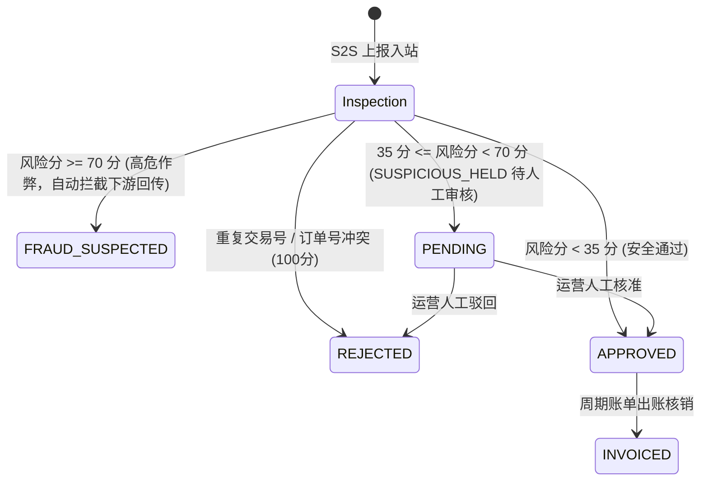

# Affiliate Platform 多触点归因算法与商业级反欺诈风控指南
# (Multi-Touch Attribution Models & Commercial Anti-Fraud Guide)

> **版本**：v2.5.0-PROD  
> **服务模块**：`platform-affiliate`  
> **核心类**：[`ConversionAttributionService.java`](file:///d:/workSpace/affiliate/platform-affiliate/src/main/java/com/affiliate/platform/affiliate/service/ConversionAttributionService.java)、[`AffiliateAntiFraudEngine.java`](file:///d:/workSpace/affiliate/platform-affiliate/src/main/java/com/affiliate/platform/affiliate/service/AffiliateAntiFraudEngine.java)

---

## 目录 (Table of Contents)

1. [多触点归因系统 (Multi-Touch Attribution - MTA)](#1-多触点归因系统-multi-touch-attribution---mta)
   - 1.1 [六大核心归因模型详解与算法公式](#11-六大核心归因模型详解与算法公式)
   - 1.2 [工业级数据驱动归因算法 (Data-Driven MTA) 原理](#12-工业级数据驱动归因算法-data-driven-mta-原理)
   - 1.3 [无损金额平账机制 (Exact Penny Balancing)](#13-无损金额平账机制-exact-penny-balancing)
   - 1.4 [多归因模型横向比对 API 与使用示例](#14-多归因模型横向比对-api-与使用示例)
2. [商业级反欺诈与流量质检引擎 (Anti-Fraud & Risk Engine)](#2-商业级反欺诈与流量质检引擎-anti-fraud--risk-engine)
   - 2.1 [CTIT (点击至转化耗时) 分布质检](#21-ctit-点击至转化耗时-分布质检)
   - 2.2 [超音速跨国地理漂移检测 (Geo Drift Inspection)](#22-超音速跨国地理漂移检测-geo-drift-inspection)
   - 2.3 [设备环境与平台突变核验 (Device & OS Mismatch)](#23-设备环境与平台突变核验-device--os-mismatch)
   - 2.4 [数据中心 IP 与爬虫自动化特征库](#24-数据中心-ip-与爬虫自动化特征库)
   - 2.5 [单 IP 分钟级转化突发泛滥风控 (Conversion Flood)](#25-单-ip-分钟级转化突发泛滥风控-conversion-flood)
   - 2.6 [动态黑白名单与审核状态机](#26-动态黑白名单与审核状态机)

---

## 1. 多触点归因系统 (Multi-Touch Attribution - MTA)

在现代复杂的数字营销链路中，消费者从首次接触推广到最终下单，通常会经历多个渠道（搜索广告、社交媒体红人、优惠券网站、邮件再营销等）的多次互动。平台提供可插拔的多模型归因引擎，精准核算各渠道的贡献价值。

### 1.1 六大核心归因模型详解与算法公式

| 归因模型 | 模式代码 | 核心逻辑与价值分配 | 适用业务场景 |
| :--- | :--- | :--- | :--- |
| **末次触点 (Last-Click)** | `LAST_CLICK` | 100% 转化价值与佣金归属于转化发生前的最后一个点击触点。 | 传统联盟营销 CPS/CPA 默认结算模型。 |
| **首次触点 (First-Click)** | `FIRST_CLICK` | 100% 转化价值与佣金归属于引发用户首次认知的第一触点。 | 品牌拉新与认知阶段的渠道 ROI 评估。 |
| **线性归因 (Linear)** | `LINEAR` | 将转化价值平均分摊给链路中的所有触点：$W_i = \frac{1}{N}$。 | 全渠道平等考量，适合平衡投放。 |
| **时间衰减 (Time-Decay)** | `TIME_DECAY` | 越临近转化发生的触点获得越高的价值分配，采用连续浮点天数的指数衰减公式：$W_i = e^{-\lambda \Delta t}$。 | 决策周期较长的大宗电商或金融产品。 |
| **位置基础 (Position-Based / U-Shape)** | `POSITION_BASED` | 首触点分配 40%，末触点分配 40%，中间所有过渡触点平摊剩余 20%。 | 兼顾“认知引导”与“最终促成”的成熟模型。 |
| **数据驱动 (Data-Driven)** | `DATA_DRIVEN` | 基于 Shapley 移除效应，综合触点交互深度、连续时间衰减、渠道刷量边际递减与位置加权。 | 商业化广告投放平台精细化归因分析。 |

---

### 1.2 工业级数据驱动归因算法 (Data-Driven MTA) 原理

传统模型通常只关注触点顺序，忽略了触点类型与渠道饱和度。平台的 `DATA_DRIVEN` 算法综合考量 4 个维度的加权因数：

1. **触点交互深度乘数 ($M_{\text{type}}$)**：
   $$\text{CLICK} = 1.0, \quad \text{ENGAGEMENT} = 0.7, \quad \text{VIEW} = 0.4, \quad \text{IMPRESSION} = 0.2$$
2. **连续平滑时间半衰期衰减 ($D_{\text{time}}$)**：
   采用 $7$ 天半衰期衰减模型（$\lambda = \frac{\ln 2}{7} \approx 0.099$）：
   $$D_{\text{time}} = \exp\left(-\lambda \cdot \Delta t_{\text{days}}\right)$$
3. **渠道频次边际递减效应 ($S_{\text{frequency}}$)**：
   同一渠道/Affiliate 在单个用户的触点链路中出现多次时，其边际贡献并非线性叠加，而是防御性递减。第 $k$ 次出现的贡献为：
   $$S_{\text{frequency}}(k) = \frac{1}{\sqrt{k}}$$
   *有效防御了某些渠道在用户下单前瞬间连续推送多次无效展示刷权重的作弊行为。*
4. **位置探索价值补偿 ($P_{\text{pos}}$)**：
   - 首触点探索奖励：$P_{\text{pos}} = 1.20$
   - 尾触点闭环奖励：$P_{\text{pos}} = 1.30$
   - 中间过渡触点：$P_{\text{pos}} = 1.00$

每个触点的原始得分：
$$\text{Score}_i = M_{\text{type}} \cdot D_{\text{time}} \cdot S_{\text{frequency}}(k) \cdot P_{\text{pos}}$$

归一化权重：
$$W_i = \frac{\text{Score}_i}{\sum_{j=1}^{N} \text{Score}_j}$$

---

### 1.3 无损金额平账机制 (Exact Penny Balancing)

在金融结算中，浮点数乘法四舍五入会导致微小的“分币误差”（如 $\$100.00$ 分配给 3 个渠道，如果均为 $\$33.33$，累计为 $\$99.99$，产生 $\$0.01$ 单边账）。

平台在算法底层设计了严格的平账机制：
```java
// 前 N-1 个触点按四舍五入分配
creditedValue = value.multiply(normalizedWeight).setScale(2, RoundingMode.HALF_UP);
runningAllocatedValue = runningAllocatedValue.add(creditedValue);

// 最后一个触点采用差值补齐，实现严格无损平账
if (i == totalTouchPoints - 1) {
    creditedValue = value.subtract(runningAllocatedValue);
}
```
**确保所有渠道分得金额之和严格等于转化总金额：$\sum \text{CreditedValue} \equiv \text{ConversionValue}$**。

---

### 1.4 多归因模型横向比对 API 与使用示例

调用 `ConversionAttributionService.compareAttributionModels(touchPoints, conversionValue)` 可一次性获得全部 6 大归因模型的比对结果：

```json
{
  "LAST_CLICK": [
    { "affiliateId": "aff_influencer", "weight": 1.0, "creditedValue": 100.00, "attribution": "Last Click" }
  ],
  "FIRST_CLICK": [
    { "affiliateId": "aff_search_engine", "weight": 1.0, "creditedValue": 100.00, "attribution": "First Click" }
  ],
  "LINEAR": [
    { "affiliateId": "aff_search_engine", "weight": 0.3333, "creditedValue": 33.33, "attribution": "Linear" },
    { "affiliateId": "aff_retargeting", "weight": 0.3333, "creditedValue": 33.33, "attribution": "Linear" },
    { "affiliateId": "aff_influencer", "weight": 0.3333, "creditedValue": 33.34, "attribution": "Linear" }
  ],
  "POSITION_BASED": [
    { "affiliateId": "aff_search_engine", "weight": 0.40, "creditedValue": 40.00, "attribution": "Position (First)" },
    { "affiliateId": "aff_retargeting", "weight": 0.20, "creditedValue": 20.00, "attribution": "Position (Middle)" },
    { "affiliateId": "aff_influencer", "weight": 0.40, "creditedValue": 40.00, "attribution": "Position (Last)" }
  ],
  "DATA_DRIVEN": [
    { "affiliateId": "aff_search_engine", "weight": 0.2845, "creditedValue": 28.45, "attribution": "Data-Driven" },
    { "affiliateId": "aff_retargeting", "weight": 0.1820, "creditedValue": 18.20, "attribution": "Data-Driven" },
    { "affiliateId": "aff_influencer", "weight": 0.5335, "creditedValue": 53.35, "attribution": "Data-Driven" }
  ]
}
```

---

## 2. 商业级反欺诈与流量质检引擎 (Anti-Fraud & Risk Engine)

### 2.1 CTIT (点击至转化耗时) 分布质检
CTIT (Click-to-Install / Click-to-Conversion Time) 是识别广告作弊的核心依据：
- **CTIT < 3 秒**：触发 `FAST_CONVERSION_CTIT_UNDER_3S`（风险分 +75）。属于典型的**点击注入 (Click Injection)** 作弊，正常真实用户不可能在 3 秒内完成落地页加载、阅读并提交订单；
- **3 秒 <= CTIT < 10 秒**：触发 `SUSPICIOUS_FAST_CONVERSION_UNDER_10S`（风险分 +25）；
- **CTIT > 30 天**：触发 `EXPIRED_ATTRIBUTION_WINDOW`（风险分 +75），超出合法归因窗口。

### 2.2 超音速跨国地理漂移检测 (Geo Drift Inspection)
- 当点击发生地（如 `US`）与转化上报地（如 `CN`）国家不同：
  - 若 **CTIT < 300 秒 (5分钟)**：判定为**超音速跨国漂移**（`GEO_LOCATION_DRIFT_SUSPECTED`，风险分 +55）。真实物理世界中人类无法在 5 分钟内跨洲移动，属于典型的机房代理洗流量或云端模拟刷单；
  - 若 **CTIT >= 300 秒**：标记为正常漫游或常规 IP 变动（`GEO_LOCATION_CHANGED`，风险分 +20）。

### 2.3 设备环境与平台突变核验 (Device & OS Mismatch)
- **设备类型不一致**：点击发生于移动设备（`deviceType=1`），但转化上报来自于桌面电脑（`deviceType=2`），触发 `DEVICE_ENVIRONMENT_MISMATCH`（风险分 +40）；
- **系统平台冲突**：点击 User-Agent 为移动端平台（`iPhone` / `Android`），转化 User-Agent 却为桌面端平台（`Windows NT` / `Macintosh`），触发 `PLATFORM_OS_MISMATCH`（风险分 +45）。

### 2.4 数据中心 IP 与爬虫自动化特征库
- **数据中心 IP 库**：内置 AWS、GCP、Azure、DigitalOcean、Aliyun 等主流云服务商的常见 CIDR 前缀库，识别拦截机房代理（`DATACENTER_PROXY_IP_DETECTED`，风险分 +45）；
- **Bot UA 签名库**：特征匹配 `headlesschrome`、`puppeteer`、`phantomjs`、`selenium`、`python-requests` 等自动化工具（`BOT_OR_HEADLESS_USER_AGENT`，风险分 +50）。

### 2.5 单 IP 分钟级转化突发泛滥风控 (Conversion Flood)
- 采用 Caffeine 自动淘汰缓存统计单 IP 每分钟的转化发生次数；
- 单 IP 1 分钟内转化上报数超过阈值（默认 10 次），触发 `IP_CONVERSION_BURST_FLOOD`（风险分 +50）。

### 2.6 动态黑白名单与审核状态机


- **自动热重载**：支持在管理控制台动态增删 IP/Sub-ID 黑名单，引擎支持微秒级 O(1) 内存拦截并自动清理过期项。
