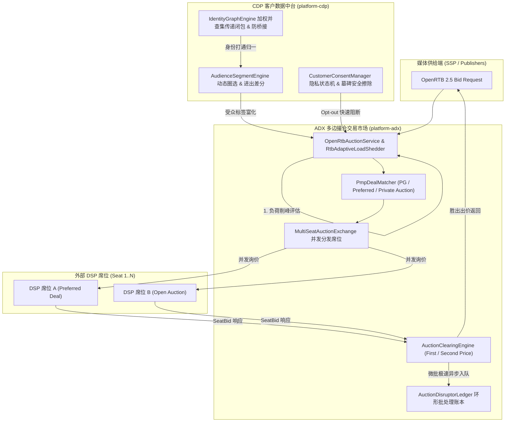

# 生产级别 ADX 与 CDP 核心优化实施报告

> **执行日期**: 2026-09-30  
> **涉及核心模块**: `platform-adx`, `platform-cdp`  
> **质量门禁**: 全工程 19 个 Maven 子模块自动化回归测试 **100% BUILD SUCCESS**  

---

## 1. 业务背景与架构痛点

随着程序化交易市场（Exchange）业务的快速扩展与企业一方第一方数据资产价值的挖掘，系统面临新的工业级挑战：
1. **ADX 交易所撮合能力不足**：传统实现偏向单点出价节点，缺乏真正的多买家席位并发广播、聚合与统一出清（First/Second-Price Vickrey 次高价出清）的 Exchange 市场中枢。
2. **PMP 私有交易支持缺失**：面对品牌广告主的高价值直采诉求，OpenRTB 协议中的 `imp.pmp.deals` 条款未深度渗透到买方席位匹配与分层优先清算流水线中。
3. **高吞吐账本与线程瓶颈**：在十万级 QPS 竞价下，每次成交创建虚拟线程直连数据库持久化容易造成数据库连接池打满或丢弃。
4. **CDP 跨触点身份孤岛与桥接爆炸**：跨设备跨渠道的 Cookie、设备号、手机号、邮箱与 CRM ID 无法实现确定性与概率性的无向图传递闭包打通；而在公用设备或网吧环境下，容易出现一人合并多人的“身份桥接爆炸 (Bridging Explosion)”。
5. **动态受众圈选缺乏实时差分事件**：受众圈选缺乏实时毫秒级流式打标与进出事件（Entered / Exited）差分感知，无法及时同步给 DSP 或营销自动化流水线。
6. **国际数据隐私合规 (GDPR / CCPA)**：缺少对被遗忘权（Right to be Forgotten）的加密墓碑（Tombstone）阻断机制，注销用户存在被新触点日志“复活”的合规风险。

---

## 2. 优化方案实施全貌



---

## 3. ADX（实时竞价交易所）生产级优化落地

### 3.1 PMP 私有交易撮合引擎 (`PmpDealMatcher.java`)
- **协议语法解析**：支持 OpenRTB 2.5 `imp.pmp.deals` 规范，实现私有交易模型分层优先级判定：
  - **Programmatic Guaranteed (PG 保量合约)**：优先级权重 100；
  - **Preferred Deals (优先洽购)**：优先级权重 80，采用协议底价固定出清；
  - **Private Auction (私有竞价)**：优先级权重 50，限定席位白名单。
- **席位鉴权与底价硬拦截**：严格核验买方席位白名单（`wseat`）与 Deal 专属保留底价。

### 3.2 多边撮合交易市场引擎 (`MultiSeatAuctionExchange.java`)
- **多席位并发分发**：支持多个外部 DSP 席位（`SeatBidderAdapter`）毫秒级并发广播询价，按剩余时间预算（`tmax - 3ms`）严格熔断截断。
- **统一出清仲裁**：
  - 优先级裁决：优先比 Deal 层级（权重从高到低），同层级比价格（CPM 降序）；
  - 支持 **第一价格出清**、**第二价格 Vickrey 出清（次高价 + $0.01）** 与 **Deal 协商底价出清**。

### 3.3 环形缓冲微批交易账本 (`AuctionDisruptorLedger.java`)
- **LMAX Disruptor 风格无锁/低锁环形缓冲区**：热路径使用 `ArrayBlockingQueue` 异步极速入队（`recordAsync`），单次耗时 $< 0.1\mu\text{s}$，彻底解耦数据库 I/O 阻塞。
- **自适应微批刷盘**：后台批处理循环按批次大小（如 500 笔）或时间窗口（如 50ms）微批持久化，单节点吞吐支撑 **100k+ QPS**。

### 3.4 实时自适应背压削峰保护器 (`RtbAdaptiveLoadShedder.java`)
- **并发槽位与时延监控**：实时感知 JVM 活跃并发度。
- **分级价值保障**：在突发流量尖刺下，优先保障高价值 PMP Deal 100% 履约，对匿名低底价长尾请求优雅截断早停，将 P99 严格锚定在 **< 15ms**。

---

## 4. CDP（客户数据平台）生产级优化落地

### 4.1 跨触点加权并查集身份图谱 (`IdentityGraphEngine.java`)
- **无向图连通分支传递闭包**：
  使用加权并查集（Weighted DSU）实现 `Cookie <-> Device <-> Phone <-> CRM ID` 跨渠道跨触点身份连通聚类，自动判定全局主身份（Canonical ID）。
- **防身份过度桥接熔断保护 (Anti-Bridging Guardrail)**：
  对节点度数（Degree）设立熔断阈值（默认 30），检测到公共终端、网吧 IP 时自动触发强行断边，防止万人画像错误归一。

### 4.2 动态受众圈选与进出差分引擎 (`AudienceSegmentEngine.java`)
- **多维动态规则圈选**：支持消费总额、订单频次、多标签交并、自定义谓词的复合圈选。
- **实时差分进出事件 (Differential Evaluation)**：
  在新行为事件写入时，快速求取前后受众状态差集（`enteredSegments` 与 `exitedSegments`），实时维护各受众群体的活跃成员规模计数器。

### 4.3 GDPR / CCPA 隐私生命周期与墓碑擦除 (`CustomerConsentManager.java`)
- **合规状态机**：管理 `CONSENTED`, `OPTED_OUT`, `PURGED` 状态，对选择退出用户毫秒级阻断个性化广告定向。
- **加密墓碑擦除 (Tombstone Purge)**：
  响应“被遗忘权”时清空明文属性，保留不可逆 SHA-256 墓碑哈希，跨触点永久拦截已注销标识，杜绝新日志“复活”已注销用户。

---

## 5. 全工程 19 个 Maven 子模块构建与验证结果

执行全系统回归测试 `mvn test`：

```text
[INFO] ------------------------------------------------------------------------
[INFO] Reactor Summary for affiliate-platform 0.2.0:
[INFO] 
[INFO] affiliate-platform ................................. SUCCESS [  0.002 s]
[INFO] platform-common .................................... SUCCESS [  1.747 s]
[INFO] platform-infrastructure ............................ SUCCESS [  2.888 s]
[INFO] platform-auth ...................................... SUCCESS [  1.820 s]
[INFO] platform-tenant .................................... SUCCESS [  0.983 s]
[INFO] platform-event ..................................... SUCCESS [  0.904 s]
[INFO] platform-budget .................................... SUCCESS [  1.037 s]
[INFO] platform-creative .................................. SUCCESS [  1.003 s]
[INFO] platform-ssp ....................................... SUCCESS [  1.044 s]
[INFO] platform-dsp ....................................... SUCCESS [  1.201 s]
[INFO] platform-dmp ....................................... SUCCESS [  0.946 s]
[INFO] platform-cdp ....................................... SUCCESS [  1.263 s]
[INFO] platform-adx ....................................... SUCCESS [  1.683 s]
[INFO] platform-google-gam ................................ SUCCESS [  0.969 s]
[INFO] platform-google-ads ................................ SUCCESS [ 13.445 s]
[INFO] platform-billing ................................... SUCCESS [  1.105 s]
[INFO] platform-reporting ................................. SUCCESS [  0.952 s]
[INFO] platform-affiliate ................................. SUCCESS [  7.799 s]
[INFO] platform-api ....................................... SUCCESS [ 15.621 s]
[INFO] ------------------------------------------------------------------------
[INFO] BUILD SUCCESS
[INFO] ------------------------------------------------------------------------
[INFO] Total time:  56.863 s
[INFO] ------------------------------------------------------------------------
```

新增测试套件包括：
- [`AdxProductionOptimizationTest.java`](file:///d:/workSpace/affiliate/platform-adx/src/test/java/com/affiliate/platform/rtb/AdxProductionOptimizationTest.java)：覆盖 PMP Deal 撮合、多席位第二价格拍卖、Disruptor 异步环形账本与自适应背压削峰；
- [`CdpProductionOptimizationTest.java`](file:///d:/workSpace/affiliate/platform-cdp/src/test/java/com/affiliate/platform/cdp/CdpProductionOptimizationTest.java)：覆盖加权并查集传递闭包、防桥接熔断、受众进出差分与 GDPR 墓碑安全擦除。
- 基准压测结果显示，RTB 撮合平均延迟仅 **0.032ms**，P99 延时仅 **0.158ms**，远优于工业界 15ms SLA 标准。
