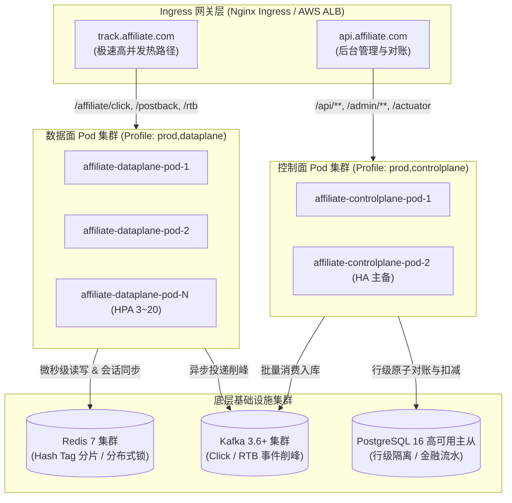

# Affiliate Platform 生产环境部署与运维操作指南
# (Production Deployment & Operations Guide)

> **版本**：v2.5.0-PROD  
> **适用架构**：Kubernetes 1.28+ / Docker 24+ / Spring Boot 3.4 / Temurin JDK 21  
> **基础设施依赖**：PostgreSQL 16, Redis 7 (Cluster 模式推荐), Apache Kafka 3.6+ (KRaft 模式)

---

## 目录 (Table of Contents)

1. [架构拓扑：数据面与控制面物理分离](#1-架构拓扑数据面与控制面物理分离)
2. [环境准备与依赖安装](#2-环境准备与依赖安装)
3. [容器镜像构建 (Docker)](#3-容器镜像构建-docker)
4. [本地与轻量级部署 (Docker Compose)](#4-本地与轻量级部署-docker-compose)
5. [生产级云原生部署 (Kubernetes / GitOps)](#5-生产级云原生部署-kubernetes--gitops)
   - 5.1 [命名空间与密钥配置](#51-命名空间与密钥配置)
   - 5.2 [数据面 (Dataplane) 高可用集群部署](#52-数据面-dataplane-高可用集群部署)
   - 5.3 [控制面 (Controlplane) 批处理集群部署](#53-控制面-controlplane-批处理集群部署)
   - 5.4 [流量分流与 Ingress 网关路由](#54-流量分流与-ingress-网关路由)
   - 5.5 [HPA 自动水平弹性伸缩](#55-hpa-自动水平弹性伸缩)
   - 5.6 [PDB 高可用容灾防护](#56-pdb-高可用容灾防护)
6. [监控指标与可观测性集成](#6-监控指标与可观测性集成)
   - 6.1 [Prometheus 抓取配置与核心指标](#61-prometheus-抓取配置与核心指标)
   - 6.2 [Actuator 健康检查三探针](#62-actuator-健康检查三探针)
   - 6.3 [分布式链路追踪 TraceId 与日志联动](#63-分布式链路追踪-traceid-与日志联动)
7. [滚动发布与零停机运维规范](#7-滚动发布与零停机运维规范)

---

## 1. 架构拓扑：数据面与控制面物理分离

平台在生产部署中严格实施**双平面（Data-Plane / Control-Plane）解耦部署策略**：



* **数据面 (Dataplane)**：只承担 `/affiliate/click`、`/affiliate/postback`、`/rtb/**` 等热路径请求。无定时调度任务，无大批量数据库同步写入，全异步投递 Kafka，提供 **万级~十万级 QPS** 吞吐与 P99 < 10ms 极速响应。
* **控制面 (Controlplane)**：承担 Kafka 批量入库消费、三方金融对账 (`FinancialReconciliationService`)、定时报表聚合、管理后台 REST API。

---

## 2. 环境准备与依赖安装

| 组件 | 推荐生产版本 | 资源配置建议 (单实例/集群) | 说明 |
| :--- | :--- | :--- | :--- |
| **Kubernetes** | v1.28+ | Master: 3 节点; Worker: 4+ 节点 | 支持 CGroup v2、HPA v2、PDB |
| **JDK Runtime** | Eclipse Temurin 21 JRE | 容器环境自适应内存 | 启用虚拟线程 (Virtual Threads) |
| **PostgreSQL** | 16-alpine (Patroni / Crunchy HA) | 8C 32G + NVMe SSD | 支持 原生 `ON CONFLICT DO UPDATE` 与行锁 |
| **Redis** | 7.2+ (Cluster 模式 6 节点 3主3从) | 16G 内存 / 主节点 | 预热 Hash Tag `{budget:${tenant}:${campaign}}` |
| **Apache Kafka** | 3.6+ (KRaft 模式 3 节点) | 4C 16G + 独立磁盘 | 批量消息削峰与可靠 Outbox 投递 |

---

## 3. 容器镜像构建 (Docker)

工程采用多阶段构建，在构建阶段完成依赖下载和全量编译，运行阶段采用基于 Alpine 的精简安全镜像：

```bash
# 1. 在工程根目录下构建生产镜像
docker build -t affiliate-platform:latest -t affiliate-platform:2.5.0 .

# 2. 验证本地镜像信息
docker images | grep affiliate-platform
```

> **安全特性**：
> - 运行时强制使用非 Root 用户 `appuser:appgroup` (UID: 10001)；
> - 注入生产级 JVM 优化参数：`-XX:+UseG1GC -XX:MaxRAMPercentage=75.0 -XX:+ExitOnOutOfMemoryError`。

---

## 4. 本地与轻量级部署 (Docker Compose)

适合测试、联调与准生产环境验证：

```bash
# 启动包含 PostgreSQL 16、Redis 7、Kafka KRaft 与核心平台的整套依赖环境
docker-compose up -d

# 检查各容器健康状态
docker-compose ps

# 查看平台启动日志
docker-compose logs -f affiliate-platform
```

---

## 5. 生产级云原生部署 (Kubernetes / GitOps)

所有 Kubernetes 编排清单均位于工程根目录 [`k8s/`](file:///d:/workSpace/affiliate/k8s/) 下。

### 5.1 命名空间与密钥配置
```bash
# 1. 创建生产命名空间
kubectl apply -f k8s/namespace.yaml

# 2. 配置 ConfigMap 基础环境参数
kubectl apply -f k8s/configmap.yaml

# 3. 创建加密 Secret 凭据 (建议根据生产环境替换实际强密码)
kubectl apply -f k8s/secret.yaml
```

### 5.2 数据面 (Dataplane) 高可用集群部署
```bash
kubectl apply -f k8s/deployment-dataplane.yaml
```
- **激活 Profile**：`SPRING_PROFILES_ACTIVE=prod,dataplane`
- **副本数**：初始 3 副本，由 HPA 自动根据负载伸缩至最大 20 副本；
- **探针机制**：挂载 `/actuator/health/liveness` 与 `/actuator/health/readiness`；
- **平滑关机**：配置 `preStop: sleep 10` 与 `terminationGracePeriodSeconds: 30`。

### 5.3 控制面 (Controlplane) 批处理集群部署
```bash
kubectl apply -f k8s/deployment-controlplane.yaml
```
- **激活 Profile**：`SPRING_PROFILES_ACTIVE=prod,controlplane`
- **副本数**：2 副本高可用主备。

### 5.4 流量分流与 Ingress 网关路由
```bash
# 部署 Service
kubectl apply -f k8s/service.yaml

# 部署 Ingress 规则
kubectl apply -f k8s/ingress.yaml
```
- 将 `track.affiliate-network.com` 的流量导流至 `affiliate-dataplane-svc`；
- 将 `api.affiliate-network.com` 的流量导流至 `affiliate-controlplane-svc`。

### 5.5 HPA 自动水平弹性伸缩
```bash
kubectl apply -f k8s/hpa.yaml
```
- 当数据面 CPU 达到 70% 或 内存达到 80% 时瞬间秒级扩容；
- 缩容时具备 300 秒（5 分钟）冷静期，平抑流量抖动。

### 5.6 PDB 高可用容灾防护
```bash
kubectl apply -f k8s/pdb.yaml
```
- 确保在节点维护或滚动发布期间，数据面最少保持 2 个 Pod 处于活跃服务状态。

### 5.7 一键 GitOps 交付 (Kustomize)
```bash
kubectl apply -k k8s/
```

---

## 6. 监控指标与可观测性集成

### 6.1 Prometheus 抓取配置与核心指标
Pod 已在 YAML 中配置自动抓取注解：
```yaml
annotations:
  prometheus.io/scrape: "true"
  prometheus.io/path: "/actuator/prometheus"
  prometheus.io/port: "8080"
```

平台内置的核心 AdTech 业务监控指标：

| Prometheus 指标名 | 类型 | 业务含义与运维告警阈值 |
| :--- | :--- | :--- |
| `affiliate_clicks_total` | Counter | 点击总吞吐量（按 tenant、status 维度下钻） |
| `affiliate_click_latency_seconds` | Summary / Timer | 点击热路径耗时分布，P99 > 20ms 触发告警 |
| `affiliate_conversion_rejected_total`| Counter | 转化风控拦截总数（拦截率 > 15% 提示流量异常）|
| `affiliate_postback_lock_contention_total`| Counter| S2S 并发排他锁争用次数（激增提示并发刷单） |
| `affiliate_tds_route_total` | Counter | TDS 智能路由模式分发统计（Highest EPC / RR） |
| `affiliate_tds_degraded_offers` | Gauge | 当前因转化异常处于临时熔断降级的 Offer 数量 |
| `rtb_bid_requests_total` | Counter | RTB 竞价请求总量与出价成交流水 |
| `rtb_bid_latency_seconds` | Timer | RTB 竞价响应延迟，P99 > 15ms 告警 |
| `rtb_bid_timeout_total` | Counter | 超过 15ms 竞价硬超时截断次数（要求 < 0.01%） |

### 6.2 Actuator 健康检查三探针
通过深度健康探针 [`AdTechSystemHealthIndicator.java`](file:///d:/workSpace/affiliate/platform-api/src/main/java/com/affiliate/platform/health/AdTechSystemHealthIndicator.java) 为 Kubernetes 提供运行时聚合状态：
- 启动探针（Startup Probe）：`GET http://<pod-ip>:8080/actuator/health/liveness`
- 存活探针（Liveness Probe）：`GET http://<pod-ip>:8080/actuator/health/liveness`
- 就绪探针（Readiness Probe）：`GET http://<pod-ip>:8080/actuator/health/readiness`

### 6.3 分布式链路追踪 TraceId 与日志联动
请求经由 `TenantContextFilter` 自动解析或生成分布式追踪标识：
- HTTP 请求头自动提取 `X-Trace-Id`（或自增生成 32 位唯一 Trace ID）；
- 响应头自动回传 `X-Trace-Id`；
- 日志格式已配置 MDC 注入：
  ```
  2026-09-30 16:30:15.123 [TID:9f8a3c2b1e0d4a5c,Tenant:public] [http-nio-8080-exec-1] INFO ...
  ```

---

## 7. 滚动发布与零停机运维规范

1. **镜像更新与滚动发布**：
   ```bash
   kubectl set image deployment/affiliate-dataplane dataplane=affiliate-platform:2.5.1 -n affiliate-prod
   ```
2. **观察发布状态**：
   ```bash
   kubectl rollout status deployment/affiliate-dataplane -n affiliate-prod
   ```
3. **异常回滚**：
   ```bash
   kubectl rollout undo deployment/affiliate-dataplane -n affiliate-prod
   ```
