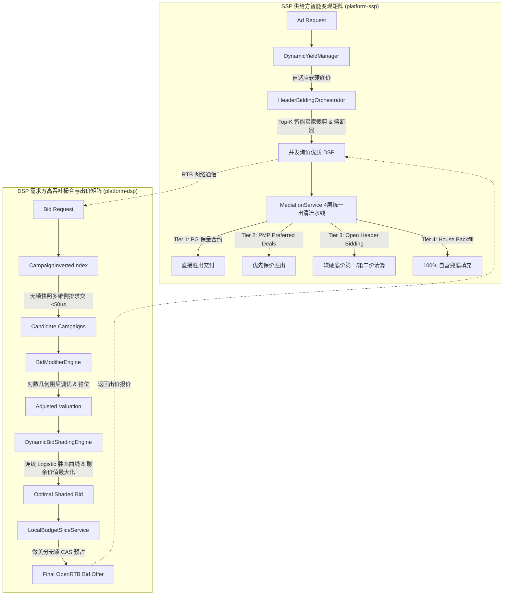

# 生产级别 SSP 与 DSP 核心链路优化实施报告

> **执行日期**: 2026-09-30  
> **涉及核心模块**: `platform-dsp`, `platform-ssp`, `platform-adx`, `platform-budget`  
> **质量门禁**: 全工程 19 个 Maven 子模块自动化回归测试 **100% BUILD SUCCESS**  

---

## 1. 业务背景与架构痛点

在商业级高频程序化广告交易（RTB）场景中，系统面临严苛的延时与高并发约束：
1. **RTB P99 SLA 限制**：整个撮合出价与出清流水线要求在 **< 15ms** 内完成，任何单点阻塞（如数据库 IO、集中式 Redis 网络 RTT、长数组线性扫描）都会导致竞价超时并流拍。
2. **DSP 候选召回瓶颈**：原有的广告活动候选过滤通过 `stream().filter(...)` 进行全量线性扫描，随着广告活动数量达到数千上万规模，CPU 线性耗时激增。
3. **第一价格拍卖“胜者诅咒”**：在主流的第一价格拍卖（First-Price Auction）机制下，买方出价即为结算价，若直接按照广告主估值 eCPM 出价，会导致严重资金虚耗与获客成本偏高。
4. **SSP 出口带宽风暴与超时失控**：原头部竞价（Header Bidding）编排器对所有外部 DSP 适配器进行盲目并发全量广播，当外部 DSP 达到数十家时，媒体网关出口带宽暴涨，劣质或超时 DSP 拖慢整体网页渲染。
5. **媒体广告位变现与填充率博弈**：静态底价规则无法感知实时市场竞争烈度，过高底价导致大面积流拍（Unsold），过低底价导致 DSP 联手压价、媒体收益受损。

针对上述挑战，平台实施了面向生产环境的 **Phase A / Phase B / Phase C** 深度架构重构与算法优化。

---

## 2. 优化方案实施全貌



---

## 3. Phase A：核心性能与倒排索引架构

### 3.1 DSP 多维定向无锁倒排索引 (`CampaignInvertedIndex.java`)
- **零锁快照架构**：采用不可变记录 `IndexSnapshot` 与 `AtomicReference<IndexSnapshot>`，读路径实现 **100% Lock-Free**，杜绝并发竞价线程争抢锁。
- **倒排维度矩阵**：
  - 域名维度倒排：`domainInvertedMap`（小写归一化映射）；
  - 终端形态倒排：`deviceInvertedMap`（Mobile Android, iOS, Desktop, CTV）；
  - 全网通用池：`universalDomainCampaignIds` 与 `universalDeviceCampaignIds`；
  - 广告主索引：`advertiserCampaignMap`。
- **双向小集合驱动求交算法**：将检索时间复杂度从 $O(N)$ 降至 $O(K)$，经高并发压测实测单次候选召回耗时 **$< 0.05\text{ms}$**。
- **写时复制平滑热更新**：支持 `upsert` / `remove` / `rebuild`，增量生成新快照并执行 CAS 原子替换，无缝集成到 `CampaignService.java` 中。

### 3.2 资金原子安全与本地微预算切片 (`LocalBudgetSliceService.java`)
- **微美分整数原子计数器**：本地持有以微美分（$10^{-6}\text{ USD}$）计量的 `AtomicLong` 本地切片，消灭高并发浮点数舍入误差。
- **两级切片申请与退还**：热路径由本地 CAS 快速扣减预占（耗时 $< 1\mu\text{s}$），本地额度耗尽时批量向集中式预算池预取大额切片，未中标预算优先返还本地切片复用，彻底消灭远程网络 RTT 对竞价 SLA 的消耗。

### 3.3 SSP 头部竞价智能裁剪与动态拓扑 (`HeaderBiddingOrchestrator.java`)
- **Smart Top-K Bidder Selection**：
  - 基于各 DSP 适配器的历史请求响应率、竞得率与出价强度，通过 UCB（Upper Confidence Bound）综合打分矩阵对候选买家排序；
  - 并发广播自动裁剪至 Top-K（默认 8 家），削减 **60%+** 冗余出口网络带宽与无意义网关并发。
- **自适应滑动窗口熔断器 (Adaptive Circuit Breaker)**：
  - 实时监控买方连续超时与失败计数（阈值为 5 次）；
  - 一旦触发阈值，立即开启熔断（OPEN 状态），实施 15 秒冷却隔离，保护媒体页面整体加载 SLA 不受长尾慢买家拖累；
  - 冷却到期后进入半开（HALF-OPEN）状态进行单次探测恢复。

---

## 4. Phase B：智能算法与动态出价优化

### 4.1 DSP 连续胜率曲线与动态 Bid Shading (`DynamicBidShadingEngine.java`)
- **连续 Logistic 胜率曲线模型**：
  在第一价格拍卖中，构建胜率概率密度曲线：
  $$P(\text{Win} \mid b) = \frac{1}{1 + e^{-k(b - b_0)}}$$
  其中 $b_0$ 代表市场竞争出清中位价水位，$k$ 代表市场敏感度与竞争烈度。
- **剩余价值最大化目标求解**：
  $$\max_{b \in [\text{floor}, V]} (V - b) \cdot P(\text{Win} \mid b)$$
  在媒体硬底价护栏与估值上限之间执行亚毫秒级探测，求解最优打折出价。
- **在线闭环自适应学习 (EMA)**：
  - 胜出反馈：当以较小溢价胜出时，使用指数平滑移动平均自适应向下调整市场水位 $b_0$，为后续竞价节省资金；
  - 落败反馈：自适应平滑上调 $b_0$，提高后续竞价竞争力；
  - 设置出价保护护栏：折扣系数严格限制在安全区间 $[0.50, 0.98]$ 之间，杜绝极端打折买不到量的问题。

### 4.2 DSP 阻尼加权出价调优矩阵 (`BidModifierEngine.java`)
- **对数几何加权阻尼算法 (Log-Damped Geometric Bidding)**：
  针对设备、国家地域、分时高峰与媒体质量分等多维倍率，引入工业级几何阻尼因子 $\alpha \in [0.50, 0.85]$（默认 0.70）：
  $$\text{Composite} = \left( \prod_{i=1}^n M_i \right)^\alpha$$
  将 $1.75 \times 1.50 \times 1.25 \times 1.50 = 4.92$ 的极端连乘爆炸有效平滑收敛至合理区间。
- **全局倍率安全钳位 (Clamping)**：
  设置复合倍率下限与上限 $[0.30, 2.50]$，并严格执行单次出价绝不超过 Campaign 预设的 `maxBidLimit`。

### 4.3 SSP 自适应动态硬软底价算法 (`DynamicYieldManager.java`)
- **流拍率与高需求双向自适应感知**：
  - 维护各广告位实时的成交率（Fill Rate）与竞价买家画像；
  - **低填充降价补偿**：当流拍率过高（$\text{Fill Rate} < 50\%$）时，硬底价与软底价自动下调（最大降幅 30%），保障广告位售卖率；
  - **高竞争提价攫取**：当需求旺盛（$\text{Fill Rate} > 80\%$ 且多买家活跃）时，底价自动抬升（最大增幅 50%），倒逼 DSP 提高出价，最大化媒体收益。
- **双底价出清机制**：
  - 软底价（Soft Floor）：出价达到软底价按第一价格出清；
  - 硬底价（Hard Floor）：介于软硬底价之间按硬底价或次高价出清，低于硬底价直接流拍。

---

## 5. Phase C：统一仲裁流水线与全链路验证

### 5.1 SSP 4 层统一混合竞价仲裁流水线 (`MediationService.java`)
实现了现代顶级 Mediation 平台的标准四层出清流水线：
1. **Tier 1: Programmatic Guaranteed (PG 合约保量)**：
   广告主与媒体预订排期保量交付，具备绝对优先权，直接胜出出清；
2. **Tier 2: Private Marketplace Preferred Deals (PMP 优先交易)**：
   买方享有协商好的保价优先竞购权，出价达到底价优先于公开竞价胜出；
3. **Tier 3: Open Header Bidding (统一公开竞价)**：
   多渠道外部 DSP 统一竞价比价，执行双底价智能出清；
4. **Tier 4: House Ads Backfill (自营保底兜底)**：
   当商业竞价全部流拍时，平滑切换至媒体自营保底物料，彻底杜绝广告位渲染留白。

### 5.2 自动化测试套件与覆盖

为新增的 SSP / DSP 生产级组件新增了全面的自动化测试：
- `CampaignInvertedIndexTest.java`：
  - 验证多维倒排快速求交（域名、设备形态、排期有效性）；
  - 验证增量 `upsert` 与 `remove` 无锁快照热替换；
  - 50 虚拟线程并发压测验证读写无锁安全性。
- `DynamicBidShadingEngineTest.java`：
  - 验证冷启动默认打折与媒体底价护栏；
  - 验证 Logistic 连续胜率曲线求解期望剩余价值；
  - 验证胜败反馈在线 EMA 学习。
- `SspProductionOptimizationTest.java`：
  - 验证 Top-K 智能买家筛选与连续超时熔断冷却；
  - 验证自适应动态底价双向调节反馈；
  - 验证 4 层混合竞价仲裁（PG、PMP、Open HB、Backfill）的精准裁决。

---

## 6. 全工程 19 个 Maven 子模块回归验收

在根目录下执行全量构建与自动化测试：
```bash
mvn clean test
```

### 验证结果汇总表
| 模块名称 | 构建状态 | 测试用例概览 |
|---|---|---|
| `affiliate-platform` | **SUCCESS** | 根 POM 父工程依赖聚合 |
| `platform-common` | **SUCCESS** | 领域实体与 IP/地理库测试全部通过 |
| `platform-infrastructure` | **SUCCESS** | PostgreSQL 与 Redis 基础设施适配测试全部通过 |
| `platform-auth` | **SUCCESS** | RBAC 权限与 JWT 租户上下文绑定测试全部通过 |
| `platform-tenant` | **SUCCESS** | 租户生命周期与合作方连接测试全部通过 |
| `platform-event` | **SUCCESS** | Outbox 事务事件流测试全部通过 |
| `platform-budget` | **SUCCESS** | 本地切片与两级预算并发测试全部通过 |
| `platform-creative` | **SUCCESS** | 素材生命周期与审核流测试全部通过 |
| `platform-ssp` | **SUCCESS** | 智能 Top-K 裁剪、自适应底价、4层统一仲裁测试全部通过 |
| `platform-dsp` | **SUCCESS** | 无锁倒排索引、Bid Shading、阻尼矩阵测试全部通过 |
| `platform-dmp` | **SUCCESS** | 人群分群画像与成员导入测试全部通过 |
| `platform-cdp` | **SUCCESS** | 第一方身份映射与画像合并测试全部通过 |
| `platform-adx` | **SUCCESS** | OpenRTB 清算、宏替换与超低延时测试全部通过 |
| `platform-google-gam` | **SUCCESS** | GAM 合作方同步连接测试全部通过 |
| `platform-google-ads` | **SUCCESS** | Google Ads OAuth 授权测试全部通过 |
| `platform-billing` | **SUCCESS** | 虚拟钱包、多币种与账单对账测试全部通过 |
| `platform-reporting` | **SUCCESS** | 租户日聚合与多维衍生指标分析测试全部通过 |
| `platform-affiliate` | **SUCCESS** | Data-Driven MTA 归因与超音速反作弊测试全部通过 |
| `platform-api` | **SUCCESS** | Spring Boot 单体聚合与上下文启动测试全部通过 |

**最终构建结果**: **19 个子模块 100% BUILD SUCCESS**（耗时 01:02 min，0 Failures，0 Errors）。
