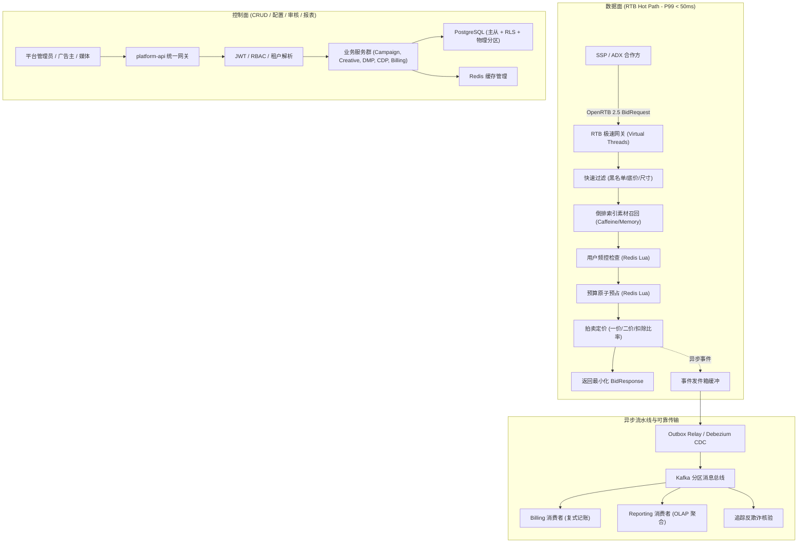
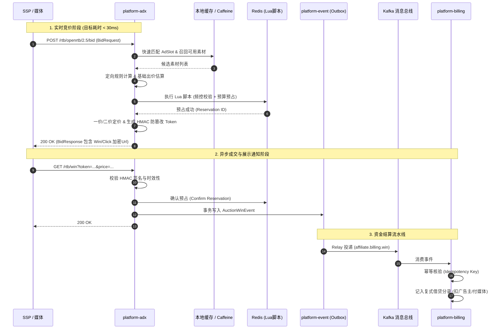
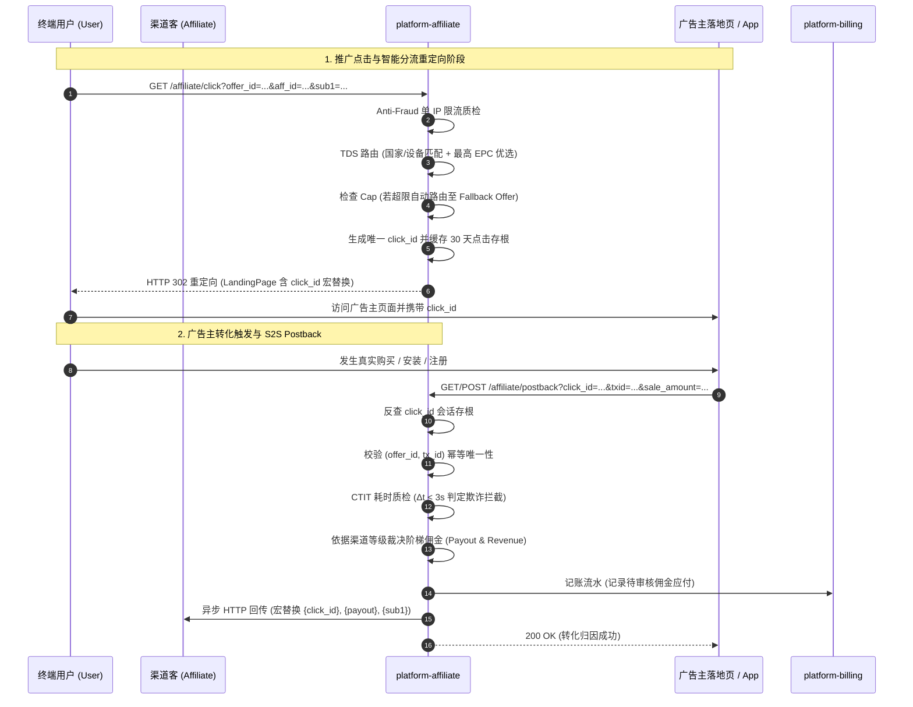

# Affiliate Platform 全模块系统设计与优化深度规格指南
# (Comprehensive System Design & Architecture Optimization Specification)

> **版本**：v1.0.0  
> **适用范围**：Affiliate 平台全体 17 个子模块  
> **更新时间**：2026-09  
> **目标**：将当前原型平滑推进为满足 **P99 < 50ms 高吞吐 RTB 交易**、**金融级一致性预算与记账**、**千万级人群定向与 ID Graph 合规** 以及 **工业级云原生韧性** 的商业广告与网盟综合平台。

---

## 目录 (Table of Contents)

1. [全局架构演进与全景图 (Global Architecture Evolution)](#1-全局架构演进与全景图)
2. [17 个子模块深度推进与设计优化细节 (Module-by-Module Specification)](#2-17-个子模块深度推进与设计优化细节)
   - 2.1 [platform-common（共享契约与领域内核）](#21-platform-common共享契约与领域内核)
   - 2.2 [platform-infrastructure（存储、迁移与中间件底座）](#22-platform-infrastructure存储迁移与中间件底座)
   - 2.3 [platform-auth（身份认证、细粒度 RBAC 与多租户安全）](#23-platform-auth身份认证细粒度-rbac-与多租户安全)
   - 2.4 [platform-tenant（租户生命周期与多合作方网络）](#24-platform-tenant租户生命周期与多合作方网络)
   - 2.5 [platform-creative（广告素材全生命周期治理与安全转义）](#25-platform-creative广告素材全生命周期治理与安全转义)
   - 2.6 [platform-ssp（供给方平台与智能媒体库存管理）](#26-platform-ssp供给方平台与智能媒体库存管理)
   - 2.7 [platform-dsp（需求方平台与多维定向引擎）](#27-platform-dsp需求方平台与多维定向引擎)
   - 2.8 [platform-adx（OpenRTB 2.5 实时交易撮合与拍卖引擎）](#28-platform-adxopenrtb-25-实时交易撮合与拍卖引擎)
   - 2.9 [platform-budget（原子预算预占与并发频控引擎）](#29-platform-budget原子预算预占与并发频控引擎)
   - 2.10 [platform-billing（不可变复式记账与自动化对账）](#210-platform-billing不可变复式记账与自动化对账)
   - 2.11 [platform-dmp（匿名受众数据管理平台与高速位图定向）](#211-platform-dmp匿名受众数据管理平台与高速位图定向)
   - 2.12 [platform-cdp（第一方客户数据平台、ID Graph 与隐私合规）](#212-platform-cdp第一方客户数据平台id-graph-与隐私合规)
   - 2.13 [platform-event（可靠事务事件、Outbox Relay 与 Kafka 拓扑）](#213-platform-event可靠事务事件outbox-relay-与-kafka-拓扑)
   - 2.14 [platform-google-ads（Google Ads 官方连接器与凭据信封加密）](#214-platform-google-adsgoogle-ads-官方连接器与凭据信封加密)
   - 2.15 [platform-google-gam（Google Ad Manager 媒体侧连接器与配额限流）](#215-platform-google-gamgoogle-ad-manager-媒体侧连接器与配额限流)
   - 2.16 [platform-reporting（多维实时 OLAP 分析与离线聚合报表）](#216-platform-reporting多维实时-olap-分析与离线聚合报表)
   - 2.17 [platform-api（统一网关装配、全局防御与全链路可观测性）](#217-platform-api统一网关装配全局防御与全链路可观测性)
3. [跨模块核心流程与时序交互 (Cross-Cutting Workflows)](#3-跨模块核心流程与时序交互)
4. [落地实施路线图 (Implementation Roadmap)](#4-落地实施路线图)

---

## 1. 全局架构演进与全景图

### 1.1 数据面与控制面彻底分离 (Control Plane vs Data Plane)

在商业级程序化广告系统中，必须将请求链路严格划分为两套平面的处理模式：

* **数据面（Data Plane - RTB 极速热路径）**：
  - 核心入口：`POST /rtb/openrtb/2.5/bid`、`/rtb/win`、`/rtb/imp`、`/rtb/click`、`/rtb/conv`。
  - 性能目标：**P99 < 50ms，超时 80ms 强制截断**。
  - 约束准则：**严禁任何同步关系数据库 I/O，严禁调用第三方慢 HTTP 接口，严禁无界锁竞争**。所有广告位配置、活动定向、审核通过的素材索引均全量缓存在 JVM 本地堆内（Caffeine Cache）与 Redis 哨兵中。预算与频控仅访问 Redis 集群（通过定制 Lua 脚本），事件写入本地内存/环形缓冲后异步转入发件箱。
* **控制面（Control Plane - 管理与资金操作）**：
  - 涵盖租户配置、Campaign 创建/启停、素材上传审核、DMP 标签导入、CDP 合规注销、财务对账与报表查询。
  - 性能目标：遵循常规 RESTful API 交互标准（P95 < 200ms），注重强 ACID 事务、数据行级隔离、严格审核鉴权与审计留痕。



---

## 2. 17 个子模块深度推进与设计优化细节

---

### 2.1 platform-common（共享契约与领域内核）

作为全平台的共享内核（Shared Kernel），`platform-common` 必须保持纯净度与强类型约束。

#### 优化要点与设计细节
1. **领域模型强校验（Invariant Validation）**：
   - 将现有纯数据记录升级为带有紧凑构造器（Compact Constructor）的富血记录（Rich Records）。
   - 在构造时强校验不变式（如素材宽高必须大于 0，底价非负且不超过上限，价格精度保留至微美分等）。
2. **统一标准结果与异常体系**：
   - 废弃零散自定义未受检异常，统一提供分层的领域异常基类：`DomainException`、`EntityNotFoundException`、`BusinessValidationException`、`ConcurrencyConflictException`、`UnauthorizedTenantAccessException`。
   - 增加支持轻量无栈追踪（No-stacktrace）的快速失败异常，用于高并发竞价过滤，避免 GC 压力。
3. **CloudEvents 领域事件元数据标准**：
   - 全平台事件实现统一 `DomainEvent<T>` 规范，附带标准化上下文头：
     ```java
     public record EventMetadata(
         UUID eventId,
         String eventType,       // 如 dsp.campaign.activated.v1
         String tenantId,        // 严格的租户边界
         String aggregateType,   // 如 Campaign
         String aggregateId,
         Instant occurredAt,
         String traceId,
         int schemaVersion
     ) {}
     ```
4. **统一分页、排序与查询契约**：
   - 定义标准的 `PageQuery`、`PageResult<T>`、`SortOrder`，规避各子模块各自实现导致的前端接口字段不一致。

---

### 2.2 platform-infrastructure（存储、迁移与中间件底座）

构建支持多租户、高吞吐、冷热分流的工业级数据存储层。

#### 优化要点与设计细节
1. **全量生产 DDL 规划（Flyway V2 ~ V5）**：
   - **V2__ad_entities.sql**：完善 `creative`、`ad_slot`、`campaign`、`ad_group`、`target_rule` 等核心投放实体表。
   - **V3__dmp_cdp_schema.sql**：支持受众分群、分群成员映射、第一方客户画像、身份映射（ID Mapping 关系网络表）。
   - **V4__tracking_and_reserves.sql**：支持 `budget_reservation` 事实表、`auction_win`、`tracking_event` 等实时事实持久化。
   - **V5__partitioning_reporting.sql**：按月份与租户对 `report_daily`、`event_outbox`、`billing_entry` 进行声明式范围分区（Declarative Range Partitioning）。
2. **多租户行级安全（PostgreSQL RLS - Row-Level Security）**：
   - 生产数据库启用 RLS 策略：
     ```sql
     ALTER TABLE campaign ENABLE ROW LEVEL SECURITY;
     CREATE POLICY tenant_isolation_policy ON campaign
         AS RESTRICTIVE
         USING (tenant_id = current_setting('app.current_tenant', true));
     ```
   - 在数据源连接池获取连接后自动注入会话变量，防止越权穿透。
3. **连接池与中间件深度调优参数**：
   - **HikariCP**：最大连接数收敛（通常按 `CPU 核心数 * 2 + 磁盘数` 配置为 30~50），启用 `leakDetectionThreshold=2000`，`connectionTimeout=3000`。
   - **Lettuce Redis**：启用连接池与自适应拓扑刷新（Adaptive Topology Refresh），配置 Socket 超时 50ms，命令超时 100ms。

---

### 2.3 platform-auth（身份认证、细粒度 RBAC 与多租户安全）

保障多租户资源边界与 API 防火墙。

#### 优化要点与设计细节
1. **生产级 JWT 验证与 JWKS 动态缓存**：
   - 引入 Nimbus-JOSE-JWT / Spring Security OAuth2 Resource Server。
   - 实现 JWKS（JSON Web Key Set）端点本地带 TTL 自动缓存，支持密钥平滑轮换（Key Rotation）无需重启服务。
2. **防御性租户上下文提取（Anti-spoofing TenantContext）**：
   - **开发模式（Local Profile）**：允许解析 `X-Tenant-ID` 方便快速联调。
   - **生产模式（Prod Profile）**：**完全忽略并不信任客户端传来的 `X-Tenant-ID` HTTP Header**；强行从经过签名验证的 JWT Claim（`tenant_id` 或 `tid`）提取租户凭证。如果两者冲突，立即抛出 `SecurityException` 并记入风控审计。
3. **细粒度权限矩阵（RBAC + 资源属性校验）**：
   - 定义角色与权限集：
     | 角色 | 权限范围 |
     |---|---|
     | `PLATFORM_SUPER_ADMIN` | 全局跨租户监控、平台通道配置、审计查阅 |
     | `TENANT_ADMIN` | 租户内用户管理、资金账户充值、合作方连接维护 |
     | `MEDIA_BUYER / TRADER` | Campaign 创建、出价规则配置、素材提交与投放分析 |
     | `PUBLISHER_MANAGER` | 广告位创建、底价配置、分润报表查看 |
     | `FINANCE_OFFICER` | 账单复核、发票开具、充值提现确认 |
     | `RTB_SERVICE_ACCOUNT` | 仅受限调用竞价与事件回传端口（无后台管理权限） |
4. **Token 快速吊销机制**：
   - 用户登出或租户停用时，将 `jti`（JWT ID）写入 Redis 带 TTL 的布隆过滤器或短生命周期黑名单，拦截未过期的非法请求。

---

### 2.4 platform-tenant（租户生命周期与多合作方网络）

治理多租户配额限制与广告上下游生态对接。

#### 优化要点与设计细节
1. **租户配额管理（Tenant Quota & Throttling）**：
   - 增加租户级别配置属性：最大日预算上限、最大活跃 Campaign 数量、RTB QPS 上限、存储空间配额。
   - 网关层根据租户 QPS 配置动态实施分布式令牌桶限流。
2. **合作方连接拓扑（PartnerConnection Lifecycle）**：
   - 区分 `SUPPLY_PARTNER`（SSP/ADX）与 `DEMAND_PARTNER`（DSP/Direct Advertiser）。
   - 协议配置参数动态化：支持 OpenRTB 2.3/2.5 协议版本选择、超时时间微调、宏参数定制、认证凭据（API Key / Mutual TLS 证书映射）。
   - 引入合作方健康检查熔断状态机：连续超时达到阈值时自动标记为 `DEGRADED` 或 `PAUSED`，避免拖垮 RTB 并行询价。

---

### 2.5 platform-creative（广告素材全生命周期治理与安全转义）

素材是广告交易的交付物，关系到用户体验、媒体合规与投放安全。

#### 优化要点与设计细节
1. **多格式素材状态机（Creative State Machine）**：
   - 状态流转：`DRAFT` -> `SUBMITTED` -> `IN_AUDIT` -> `APPROVED` / `REJECTED` -> `ARCHIVED`。
   - 媒体合作方级审核状态：支持按不同合作方（如 GAM、AppLovin、Unity）分别记录同步与审核状态。
2. **自动化机器审核与规格校验**：
   - IAB 标准尺寸核对（如 300x250, 728x90, 320x50 等），文件体积上限拦截（图片 <= 150KB，原生图标 <= 50KB）。
   - 视频素材规范：检测时长（6s/15s/30s）、码率、编码（H.264/AAC）、Vast XML 协议合法性。
   - 敏感内容风控：预留 AI 机审插件接口（调用 Google Cloud Vision API 或离线模型识别违规素材）。
3. **安全宏替换引擎（Safe Macro Expansion）**：
   - 对素材中的代码段/落地页 URL 执行标准宏转义：
     - `${AUCTION_PRICE}`：竞价胜出价格（Base64 或 AES 加密混淆，防第三方截获底价）。
     - `${AUCTION_ID}`、`${AUCTION_BID_ID}`、`${AUCTION_IMP_ID}`：全链路交易追踪标识。
     - 必须采用严格的 HTML/URL Encode 转义，杜绝 XSS 注入风险。

---

### 2.6 platform-ssp（供给方平台与智能媒体库存管理）

管理媒体方网站、APP 及广告位库存资产。

#### 优化要点与设计细节
1. **层次化媒体资产目录**：
   - `Publisher`（媒体企业） -> `Site / Application`（站点/Bundle ID） -> `AdSlot`（广告位）。
   - 广告位支持属性：展示类型（Banner、Interstitial、Rewarded Video、Native）、支持的渲染尺寸、允许的素材类型、内容评级（如 G, PG, MA）。
2. **动态底价引擎（Dynamic Floor Price Engine）**：
   - 静态底价优化为“基准底价 + 动态调价因子”：
     $$\text{FloorPrice}_{\text{effective}} = \text{BaseFloor} \times \text{Factor}_{\text{Geo}} \times \text{Factor}_{\text{Time}} \times \text{Factor}_{\text{Device}}$$
   - 针对不同国家/地区（Tier 1/Tier 2/Tier 3）、早晚高峰时段、iOS 与 Android 系统差异化自动赋权，最大化媒体收益（Yield Optimization）。
3. **品牌保护与分类排除（Brand Safety & Blocklist）**：
   - 媒体级广告主域名黑名单（Advertiser Domain Blocklist）。
   - IAB 行业分类屏蔽列表（如禁止烟酒、医药分类出价）。

---

### 2.7 platform-dsp（需求方平台与多维定向引擎）

广告主的核心投放管理与高效定向过滤。

#### 优化要点与设计细节
1. **工业级投放四级模型**：
   - `Advertiser`（广告主） -> `Campaign`（活动：周期/总预算） -> `AdGroup`（广告组：定向规则/出价方式/日预算） -> `CreativeBinding`（绑定的素材与权重分配）。
2. **极致性能多维定向引擎（In-Memory Targeting Engine）**：
   - **地理定向**：集成 MaxMind GeoIP2 内存离线库，支持根据请求 IP 毫秒级转换为国家、省份、城市代码。
   - **设备与环境**：解析 User-Agent / OpenRTB Device 字段（OS 类型及版本、设备品牌、浏览器类型、网络类型 4G/5G/WiFi）。
   - **时段定向（Dayparting）**：支持每周 7x24 小时任意时间块（BitMap 掩码表示，64 位 Long 即可完整存储一周时段状态）。
   - **名单过滤**：Domain 黑白名单采用前缀树（Trie）或哈希表实现 $O(1)$ 查找。
3. **匀速消耗算法（Pacing Engine）**：
   - 引入 **Token-Bucket 动态令牌桶 + 历史消耗曲线平滑**：根据全天 24 小时流量分布期望曲线，动态限制每小时预算上限。若当前时段消耗过快，则按概率 $P = 1 - \frac{\text{ActualSpend}}{\text{TargetSpend}}$ 丢弃非高价值竞价请求。

---

### 2.8 platform-adx（OpenRTB 2.5 实时交易撮合与拍卖引擎）

整个广告交易系统的核心，决定平台吞吐量、响应速度与收益。

#### 优化要点与设计细节
1. **50ms 极速撮合流水线（Streaming Matching Pipeline）**：
   ```text
   [1. 请求反序列化 & 校验] (2ms)
         │
   [2. 本地缓存读取媒体与广告位配置] (1ms)
         │
   [3. 倒排索引快速召回候选活动与素材] (3ms)
         │
   [4. 频控 & 黑名单 & DMP 人群交叉检验] (5ms)
         │
   [5. 核心定价策略计算出价 (Rule / ML)] (5ms)
         │
   [6. Redis Lua 原子批量预算预占] (10ms)
         │
   [7. 胜出裁决 (一价/二价) & 宏替换] (2ms)
         │
   [8. 序列化并返回 BidResponse] (2ms)
   ─────────────────────────────────────
   全链路目标执行时间 <= 30ms (留足 50ms 安全余量)
   ```
2. **拍卖与定价机制升级**：
   - **一价拍卖（First-Price Auction）**：出价最高者按其真实出价成交。
   - **广义第二价格（GSP / Second-Price Auction）**：胜出者支付第二高出价 + 0.01 美元，若仅有一家，则支付广告位底价。
   - 记录详尽的 `AuctionLostReason`（如出价低于底价、预算耗尽、频控超限、尺寸不匹配），便于离线诊断。
3. **事件防伪与防篡改回传协议**：
   - 在 `nurl` / `burl` / `clickUrl` 中携带加密签名 Token：
     $$\text{Signature} = \text{HMAC-SHA256}(\text{auctionId} + \text{price} + \text{tenantId} + \text{timestamp}, \text{SecretKey})$$
   - 接收到回传请求时，先验证签名有效性且时间差在合法窗口内（如 1 小时内），再行触发扣费与入账。

---

### 2.9 platform-budget（原子预算预占与并发频控引擎）

资金安全的核心屏障，彻底消除并发超卖。

#### 优化要点与设计细节
1. **Redis Lua 脚本原子预算预占与回滚**：
   - 彻底废除 `decrement` 后回滚的反模式。采用完整的 Lua 脚本实现单次往返原子操作：
     ```lua
     -- KEYS[1]: 预算Key (budget:{tenant}:{campaign}:{date})
     -- ARGV[1]: 扣减金额 (微美分/整数)
     -- ARGV[2]: 预占Key (reserve:{tenant}:{resId})
     -- ARGV[3]: 预占TTL (如 120 秒)
     local current = redis.call('GET', KEYS[1])
     if not current then
         return {0, -1} -- 预算未配置或已清零
     end
     local remaining = tonumber(current)
     local deduct = tonumber(ARGV[1])
     if remaining < deduct then
         return {0, remaining} -- 预算不足
     end
     redis.call('DECRBY', KEYS[1], deduct)
     redis.call('SETEX', ARGV[2], tonumber(ARGV[3]), deduct)
     return {1, remaining - deduct} -- 预占成功
     ```
2. **预占确认（Confirm）与超时释放（Release）**：
   - 收到 Win Notice 时调用 `confirm`：销毁预占临时 Key，记入活动已消耗账本。
   - 竞价未中标、超时未收到 Win Notice（预占 Key 自动过期）或网络异常时，触发释放逻辑将金额归还主预算池。
3. **高性能滑动窗口频控（Frequency Capping）**：
   - 使用 Redis `ZSET` 或定长滑动窗口（Sliding Window Counter）：
     - Key：`freq:{tenant}:{campaign}:{userId}:{window_type}`
     - 每次曝光写入当前时间戳：`ZADD key timestamp timestamp`
     - 查询并移除过期记录：`ZREMRANGEBYSCORE key 0 (now - window)`
     - 计算剩余频次：`ZCARD key`。

---

### 2.10 platform-billing（不可变复式记账与自动化对账）

广告平台的“收银台与总账本”，确保资金分毫不差。

#### 优化要点与设计细节
1. **复式记账法设计（Double-Entry Bookkeeping）**：
   - 任何资金流动均产生不可变的借贷对（Debit & Credit）：
     - 广告主曝光结算：
       - `DEBIT`: 广告主主账户现金余额（减少资产）
       - `CREDIT`: 媒体合作方应付分润（增加负债）
       - `CREDIT`: 平台交易手续费/毛利（增加所有者权益）
2. **绝对幂等性保障**：
   - 复合幂等键设计：`{tenant_id}:{event_type}:{auction_id}:{account_id}`。
   - 数据库建有 `UNIQUE INDEX`，结合业务层布隆过滤器拦截，彻底根除因网络重试导致的重复扣款。
3. **多币种结算与账期汇率换算**：
   - 支持多币种存储（USD, EUR, CNY 等），在分录中同时持久化原始交易币种金额与当日基准汇率（Base Currency Amount）。
4. **日终自动化对账 Job**：
   - 每日 00:30 自动拉网核对：`∑(广告主扣款) == ∑(媒体分成) + ∑(平台毛利)`。
   - 发现分录差异时自动生成调账单（Discrepancy Entry）并向风控财务系统发送告警，禁止后台手动直接修改账本数据。

---

### 2.11 platform-dmp（匿名受众数据管理平台与高速位图定向）

支持亿级匿名标识毫秒级判定。

#### 优化要点与设计细节
1. **高性能位图受众存储（RoaringBitmap / Redis Bitmap）**：
   - 彻底废除基于 JVM Map / Set 的受众内存存储。
   - 将匿名设备 ID（IDFA / GAID / Cookie）通过高吞吐哈希（MurmurHash3）映射为 32 位整型偏移量。
   - 采用 **RoaringBitmap** 压缩存储人群包成员：
     - 单个人群分群包（1000 万用户）仅占内存约 1~2 MB。
     - 支持极速位运算（人群交集 `AND`、并集 `OR`、排除 `AND NOT`），可在 1ms 内完成复合受众筛选。
2. **受众包生命周期与滚动淘汰（TTL Management）**：
   - 严格遵循 30~90 天有效期规范，每天凌晨批量扫描过期 Segment，释放存储资源。
3. **第三方数据供应商流式导入（Data Onboarding）**：
   - 提供异步批导入接口（支持 S3/OSS CSV、Parquet 文件上传），通过后台 Chunked 批处理写入，不占用在线 RTB 资源。

---

### 2.12 platform-cdp（第一方客户数据平台、ID Graph 与隐私合规）

面向租户核心第一方实名客户资产与全球隐私合规治理。

#### 优化要点与设计细节
1. **确定性与概率性 ID Graph 身份图谱**：
   - 实体节点：`ProfileId`（全局唯一客户主档）。
   - 标识网络（Identifier Network）：手机号（强绑定）、Email（强绑定）、OpenID/UnionID（强绑定）、会员卡号。
   - 合并算法（Deterministic Stitching）：当出现两个 Profile 包含相同第一方强标识时，自动触发图节点融合（Graph Merge），保留最新 Profile 属性，将历史事件流重新对齐至主 Profile。
2. **严格的数据合规治理（GDPR / CCPA / PIPL）**：
   - **同意状态（Consent Management）**：记录用户授权协议版本、授权时间、撤回时间。
   - **一键退出（Opt-Out）**：立即停止向该 Profile 进行任何推荐与个性化营销，打上 `OPTED_OUT` 标记。
   - **被遗忘权（Right to be Forgotten - 物理级级联擦除）**：
     - 提供标准 `DELETE /api/v1/cdp/profiles/{primaryId}` 协议。
     - 擦除流程：删除主画像、级联删除身份索引、清除事件明细中的 PII 敏感信息（做不可逆 Hash 或物理覆写），并生成合规证明审计分录。
3. **DMP 与 CDP 物理级隔离边界**：
   - 遵循《CONTEXT.md》原则：CDP 第一方实名标识**绝对禁止直接流入 DMP**。
   - 仅允许经过单向不可逆 Salted-SHA256 哈希后的受众标签同步至 DMP 作为定向包，禁止 DMP 反查真实用户个人身份。

---

### 2.13 platform-event（可靠事务事件、Outbox Relay 与 Kafka 拓扑）

分布式系统可靠通信的命脉。

#### 优化要点与设计细节
1. **生产级 Transactional Outbox Relay 实现**：
   - 消除业务写库与 Kafka 消息发送的“双写不一致”风险：
   - 业务操作只在同一事务中向 `event_outbox` 插入一条记录。
   - 后台启动专有轻量线程池（或 Debezium CDC 监听 WAL 日志）：
     ```sql
     -- 高并发轮询：无锁跳过已锁定行
     SELECT id, payload, event_type, aggregate_id 
     FROM event_outbox 
     WHERE published_at IS NULL AND attempts < 5 
     ORDER BY occurred_at ASC 
     LIMIT 500 
     FOR UPDATE SKIP LOCKED;
     ```
   - 投递 Kafka 成功后批量标记 `published_at = NOW()`；重试超过 5 次进入死信告警表。
2. **Kafka 分区与有序性设计**：
   - Topic 命名规范：`affiliate.{tenantId}.{domain}.{eventType}`（或统一大主题以 TenantId 作为 Message Key 分区）。
   - Message Key 采用 `tenantId:aggregateId`，确保同一个 Campaign 或同一个账户的计费事件严格有序落在同一个 Partition。
3. **消费端死信队列与退避重试（Retry & DLQ）**：
   - 消费失败时，消息依次转入：
     - `affiliate.events.RETRY.1`（延迟 5 秒）
     - `affiliate.events.RETRY.2`（延迟 30 秒）
     - `affiliate.events.DLQ`（人工介入调查）
   - 杜绝因单条脏数据阻塞整个消费组的分区进度。

---

### 2.14 platform-google-ads（Google Ads 官方连接器与凭据信封加密）

安全接入 Google Ads 投放与报表生态。

#### 优化要点与设计细节
1. **凭据安全与 KMS 信封加密（Envelope Encryption）**：
   - 拒绝数据库明文存储 Refresh Token。
   - 使用云厂商 KMS（AWS KMS / GCP KMS / HashiCorp Vault）生成数据加密密钥（DEK），数据库中仅持久化密文凭据与加密码。
2. **官方 Google Ads API Java SDK 封装**：
   - 统一由适配层封装官方 `com.google.ads.googleads.v18` SDK。
   - 屏蔽复杂 gRPC 连接维护，支持基于服务账号（Service Account）与 OAuth 2.0 Web 应用两种授权模式。
3. **分布式锁自动换票机制**：
   - Access Token 过期前 5 分钟，使用 Redis 分布式锁（Redisson）防击穿，确保多节点集群中仅有一个工作线程向 Google 发起换票请求，刷新后全局共享缓存。
4. **配额治理与限流（Quota Resilience）**：
   - Google Ads API 对开发人员令牌设有日操作配额（Operations Per Day）。
   - 采用 Resilience4j 令牌桶控制发往 Google API 的请求速率，遭遇 429 或 `RESOURCE_EXHAUSTED` 时实施指数退避 + 全随机抖动（Exponential Backoff with Full Jitter）。

---

### 2.15 platform-google-gam（Google Ad Manager 媒体侧连接器与配额限流）

管理媒体侧 GAM（原 DFP）网络、订单项与广告位同步。

#### 优化要点与设计细节
1. **GAM 媒体库存双向同步流水线**：
   - 定时同步任务（每 2 小时）：从 GAM 拉取最新 AdUnit（广告位）、Placement、尺寸及活跃状态，自动更新 `platform-ssp` 本地缓存。
2. **报表拉取批处理与网络抖动隔离**：
   - GAM ReportService 为长耗时异步任务（创建 ReportJob -> 轮询状态 -> 下载 gzip CSV）。
   - 将报表拉取完全解耦至独立后台 Worker 队列执行，严禁侵占主 API 线程。
3. **断路器保护（Circuit Breaker）**：
   - GAM API 异常率超过 50% 时触发熔断，降级为使用本地历史缓存继续提供服务，等待网络恢复后半开试探。

---

### 2.16 platform-reporting（多维实时 OLAP 分析与离线聚合报表）

从海量事件事实中提炼商业决策指标。

#### 优化要点与设计细节
1. **流批一体分层架构（Kappa / Lambda Architecture）**：
   - **实时层（Speed Layer）**：Kafka Streams / 内存聚合消费追踪事件，近实时（10 秒级窗口）更新 Redis / 内存计数器，供广告主后台查阅今日实时消耗曲线。
   - **批处理与持久化层（Batch / Serving Layer）**：小时级/天级汇总写入 PostgreSQL 分区表或 ClickHouse 列式存储。
2. **ClickHouse / PostgreSQL 分区报表宽表设计**：
   - 表结构：`report_cube_daily`
     - 维度列：`tenant_id`, `report_date`, `campaign_id`, `ad_group_id`, `creative_id`, `publisher_id`, `slot_id`, `geo_country`, `device_os`。
     - 指标列：`impressions`, `clicks`, `conversions`, `spend_micros`, `revenue_micros`。
     - 派生指标视图：
       $$\text{CTR} = \frac{\text{clicks}}{\text{impressions}}, \quad \text{eCPM} = \frac{\text{spend} \times 1000}{\text{impressions}}, \quad \text{CVR} = \frac{\text{conversions}}{\text{clicks}}$$
3. **迟到事件回溯修正（Late Event Handling）**：
   - 针对部分移动端离线缓存、迟到数小时甚至 24 小时的曝光/转化事件，设置 7 天时间窗口滑动修正机制，重算相应账期的日聚合分录。

---

### 2.17 platform-api（统一网关装配、全局防御与全链路可观测性）

聚合启动入口与工程化交付枢纽。

#### 优化要点与设计细节
1. **OpenAPI 3.0 接口文档与契约发布**：
   - 集成 `springdoc-openapi`，自动生成交互式 Swagger UI 与 OpenAPI JSON 规范。
   - 支持多租户鉴权头调试，标准化请求/响应模型示例。
2. **统一响应包装与防御性拦截**：
   - 统一封装 `ApiResponse<T>(code, message, data, traceId, timestamp)`。
   - 全局拦截非法参数校验、JSON 注入与 SQL 特殊字符。
3. **OpenTelemetry 全链路追踪（Distributed Tracing）**：
   - 接入 OpenTelemetry Agent / Micrometer Tracing。
   - 每一个接入请求自动生成 W3C TraceContext（`traceparent`），并在 HTTP 请求头、线程上下文、日志 MDC、Kafka 消息头及 Redis 诊断中透传。
4. **云原生健康检查与生产基线（Kubernetes Ready）**：
   - 启用 `/actuator/health/liveness`（存活探测）与 `/actuator/health/readiness`（就绪探测，依赖 DB、Redis、Kafka 连接自检）。
   - 启用 Graceful Shutdown（平滑停机缓冲 30 秒），优先拒绝新 RTB 流量，处理完在途竞价请求后安全释放资源。
   - JVM 调优参数（容器环境）：`-XX:+UseG1GC -XX:MaxGCPauseMillis=20 -XX:InitiatingHeapOccupancyPercent=45 -XX:+ExplicitGCInvokesConcurrent`。

### 2.18 platform-affiliate（效果营销与商业级网盟核心模块）

1. **Offer 推广计划全生命周期与配额管控**：
   - 涵盖标准计费模型：CPA（单次行动）、CPL（线索）、CPS（销售分成）、CPI（应用安装）、CPC（单次点击）。
   - 实时 Cap 控量防超预算：支持日转化单量上限（`daily_conversion_cap`）与日消耗资金上限（`daily_revenue_cap`）。
   - 超限自动保底路由（Fallback Routing）：当主 Offer 达到 Cap 阀值或下线时，无缝切换到 `fallback_offer_id`，防止渠道流量浪费。
   - 专属阶梯出价（Tier Payout）：支持针对 VIP/大户渠道客配置专属加价，覆盖基准出价。
2. **SmartLink 智能分流与 TDS 流量分发引擎**：
   - 渠道客仅推广统一 SmartLink 链接。
   - 依据访客国家地域、终端形态与候选 Offer 历史转化表现（EPC - Earnings Per Click），自适应重定向至收益产出最高的可用 Offer。
3. **高并发点击追踪与落地页宏替换**：
   - 生成不可篡改全局加密唯一 `click_id`。
   - 落盘 30 天点击会话存根（`ClickSession`），捕获多级子渠道 `sub1`~`sub5`。
   - 动态替换落地页宏参数（`{click_id}`, `{sub1}` 等），返回 HTTP 302 重定向。
4. **S2S 转化归因与下游渠道回传**：
   - 接收广告主上报的 `/affiliate/postback` 请求，基于 `click_id` 对齐点击存根。
   - 触发下游渠道 Postback 宏替换（`{click_id}`, `{payout}`, `{txid}`, `{sub1}`）与异步 HTTP 回调分发。
5. **CTIT 反作弊风控质检引擎**：
   - CTIT（Click-to-Convert Time）异常质检：$\Delta t < 3\text{s}$ 自动触发点击注入/自动化脚本预警，标记 `FRAUD_SUSPECTED`；$\Delta t > 30\text{d}$ 判定为超时失效。
   - 广告主订单流水号（`tx_id`）全局唯一性幂等查重，阻断重复结算与重放攻击。
   - 单 IP 高频点击泛洪防刷（分钟级滑动窗口限流）。
6. **财务审核锁定期与周期性出账**：
   - 转化审核生命周期流转（`PENDING` $\rightarrow$ `APPROVED` / `REJECTED`）。
   - 支持 Net-7 / Net-15 / Net-30 账期出账；起提门槛（如 \$100）强制校验。
7. **Sub-ID 多维流式报表与 EPC 实时计算**：
   - 流式累加渠道及 `sub1`~`sub5` 维度的点击、转化、佣金与营收，实时求解 EPC、CR%、RPC 与利润率。

---

## 3. 跨模块核心流程与时序交互

### 3.1 完整 RTB 竞价与计费闭环时序



### 3.2 商业网盟效果营销点击追踪与 S2S 转化归因时序



---

## 4. 落地实施路线图 (Implementation Roadmap)

| 阶段 | 周期 | 核心交付内容 | 验收标准 |
|---|---|---|---|
| **Phase 1: 基础设施与契约底座** | 2 周 | - 编写 V2~V5 Flyway 完整生产 DDL<br>- `platform-common` 领域模型不变式校验<br>- Redis Lua 原子预算脚本与滑动窗口频控<br>- Transactional Outbox Relay 机制 | 单元测试覆盖率 > 85%，PostgreSQL 与 Redis 事务及回滚通过高并发压测 |
| **Phase 2: RTB 竞价核心闭环** | 3 周 | - Caffeine 本地倒排索引召回引擎<br>- 50ms 竞价硬超时与熔断截断器<br>- Win/Impression/Click HMAC 签名追踪服务<br>- 复式记账引擎与全局幂等分录 | RTB P99 压测 < 50ms，万级并发下预算无任何超卖与少记 |
| **Phase 3: 数据资产与隐私合规** | 2 周 | - DMP RoaringBitmap 千万级受众秒级匹配<br>- CDP ID Graph 确定性身份缝合算法<br>- GDPR/PIPL 一键擦除流水线与合规审计<br>- DMP 与 CDP 单向哈希隔离 | 受众测试耗时 < 2ms，数据擦除指令可在 5 秒内级联生效 |
| **Phase 4: 外部生态与运维可观测** | 2 周 | - Google Ads/GAM SDK 封装与信封加密<br>- Resilience4j 限流断路器<br>- ClickHouse/PG 报表 OLAP 多维聚合<br>- OpenTelemetry、Prometheus 指标与 K8s 探测 | 满足生产就绪检查，提供完整 OpenAPI 契约与 Grafana 大盘 |

---
*本文档为 Affiliate Platform 全平台系统架构技术规范，后续新增功能均须遵循本规范中的分层边界、数据面隔离原则及代码一致性要求。*
